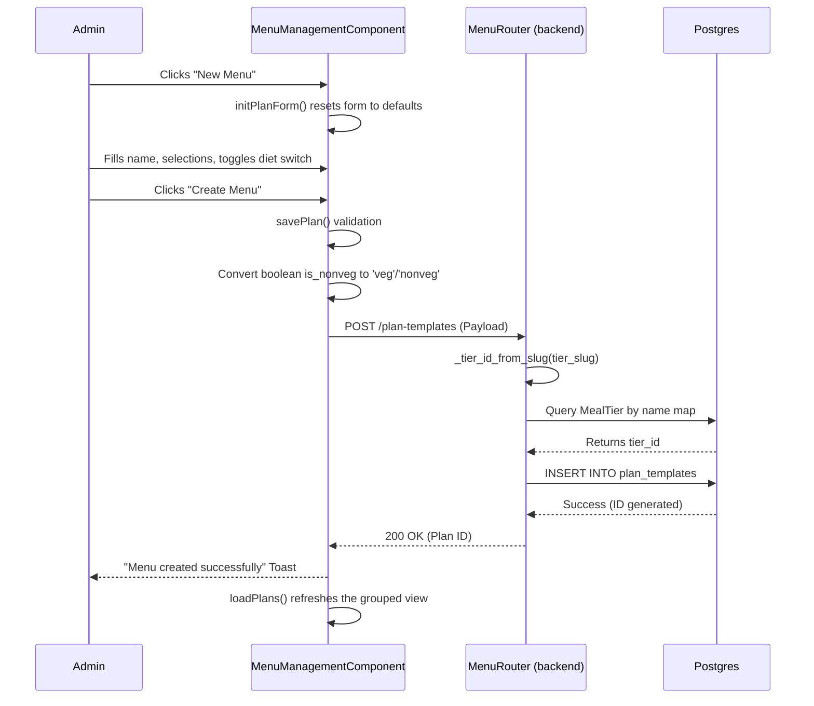
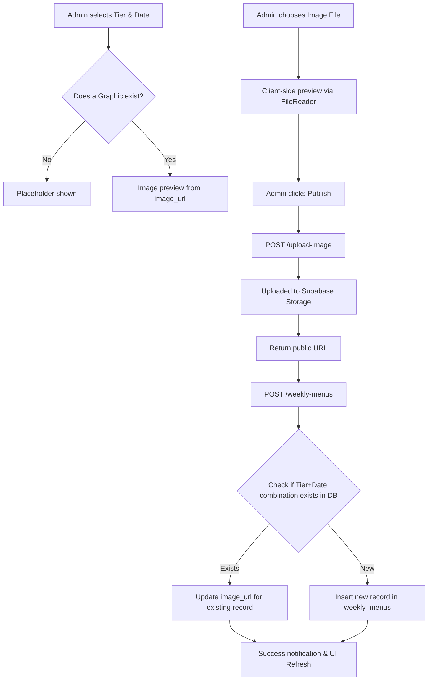

# Nutribox Menu Management: Technical Logic Documentation

This document provides a comprehensive breakdown of the Menu Management system in the Nutribox application, covering both frontend implementation and backend business logic.

---

## 1. High-Level Overview
The Menu Management system allows administrators to:
1.  **Manage Subscription Plans**: Create, edit, and delete meal plans (e.g., "Standard Weekly Lunch") categorized by Tiers.
2.  **Publish Weekly Menus**: Associate specific graphic images with meal tiers for a particular week/date.

---

## 2. Backend Logic (`backend/app/routers/menu.py`)

### A. Data Models
-   **`MealTier`**: The primary categorization (e.g., Protein Rich, Classic, Premium, Fruits Bowl). Every plan belongs to a tier.
-   **`PlanTemplate`**: Defines a specific subscription offering. Includes name, duration (weekly/monthly), meal slots (breakfast/lunch/dinner), price, and delivery charges.
-   **`ModWeeklyMenu`**: Connects a specific `MealTier` to a specific `week_start_date` and an `image_url`.

### B. Core Internal Helper: `_tier_id_from_slug`
The frontend uses human-readable slugs like `protein_rich`. The backend maps these using a fixed dictionary:
```python
FIXED_TIER_LABELS = {
    "protein_rich": "Protein Rich",
    "classic": "Classic",
    "premium": "Premium",
    "fruits_bowl": "Fruits Bowl",
}
```
**Logic**: When a request comes in with a slug, the backend looks up the equivalent DB record. If the tier doesn't exist yet, it **auto-creates** it with default values to ensure no orphan plans are created.

### C. Plan Creation Logic (`POST /plan-templates`)
1.  Receives a Pydantic `PlanTemplatePayload`.
2.  Resolves the `tier_slug` to a `tier_id` using the helper above.
3.  Calculates necessary fields and inserts a new `PlanTemplate` record.
4.  **Database Fix**: The `meals_per_slot` column is set to nullable to allow flexible plan definitions where the exact meal count per slot isn't fixed.

### D. Image Upload & Weekly Mapping
-   **Supabase Integration**: Images are uploaded directly to Supabase storage buckets via the `/upload-image` endpoint.
-   **Weekly Menu Logic**: When an image is "Published" for a tier and date, the backend checks for an existing record for that `tier_id` + `date`. If found, it updates the `image_url`; otherwise, it creates a new entry.

---

## 3. Frontend Logic (`frontend/.../menu-management.component.ts`)

### A. Tabbed Interface
-   **Tab 0 (Menu List)**: Displays plans grouped by their tier. It uses a custom `tierOrder` array to ensure consistent UI display (Protein Rich → Classic → Premium → Fruits Bowl).
-   **Tab 1 (Menu Images)**: Handles the binary state of menu graphic publication. Admin selects a tier and a date, uploads an image, and saves.

### B. Reactive Form Handling (`PlanForm`)
-   **Diet Type Logic**: Instead of a simple dropdown, the UI uses a toggle switch. The logic converts a boolean `is_nonveg` field into the backend-expected string (`veg` or `nonveg`) during submission.
-   **Multi-Select Slots**: Admin can pick multiple slots (Breakfast, Lunch, Dinner). These are sent as a string array, which Postgres stores in an `ARRAY(TEXT)` column.

### C. Bulk Actions
-   The "Delete Selected" feature allows clearing multiple plans within a specific tier group simultaneously, using the `/plan-templates/bulk-delete` endpoint for performance.

---

## 4. In-Depth Workflow Logic

### A. Lifecycle of a Menu Plan (The "Add Menu" Workflow)



**Step-by-Step Backend Logic**:
1.  **Incoming Request**: FastAPI receives the JSON payload. Pydantic validates types (e.g., `price` must be numeric).
2.  **Tier Resolution**: The `tier_slug` (e.g., `classic`) is mapped to "Classic". The DB is queried for a tier with that name.
3.  **Data Preparation**: The `tier_slug` is removed from the payload dictionary and replaced with the actual `tier_id` UUID.
4.  **Database Commit**: The SQL engine executes the `INSERT`. If the `meals_per_slot` is missing from the payload, it is inserted as `NULL` (supported after the recent migration).
5.  **Instance Refresh**: SQLAlchemy's `db.refresh(db_plan)` ensures the object returned to the frontend contains any fields generated by the DB (like the primary key `id`).

### B. Menu Image Publication Workflow



**Step-by-Step Logic**:
1.  **Selection**: Use of `PrimeNG DatePicker` ensures only a valid `Date` object is passed.
2.  **Storage**: The `upload_image` endpoint generates a unique UUID filename to avoid collisions in Supabase.
3.  **Mapping**: The `executeMenuSave` function in the frontend orchestrates the two-step process: (1) Storage upload, (2) Metadata mapping in the DB.
4.  **Lookup**: The `GET /weekly-menus` endpoint is called whenever the Tier or Date changes to dynamically update the preview area.

---

## 5. Database Structure Summary

| Table            | Key Logic/Constraints                                                                 |
| ---------------- | ------------------------------------------------------------------------------------- |
| `meal_tiers`     | Stores `diet_type` constraints ('veg', 'nonveg', 'both') and delivery charge defaults. |
| `plan_templates` | Links to `meal_tiers`. Stores arrays for meal slots. `price` is 8,2 Numeric.           |
| `weekly_menus`   | Links `tier_id` and `week_start_date`. Primary source for the customer-facing menu.   |

---

## 6. Recent Technical Resolutions
-   **Nullable `meals_per_slot`**: Fixed a 500 error where the DB required an integer for a field the frontend wasn't providing.
-   **Tier Categorization**: Standardized the app to use 4 specific tiers, replacing legacy categories like "Budget Friendly".
-   **Dynamic Pricing**: Implemented logic to handle both weekly and monthly pricing models within the same table structure.
